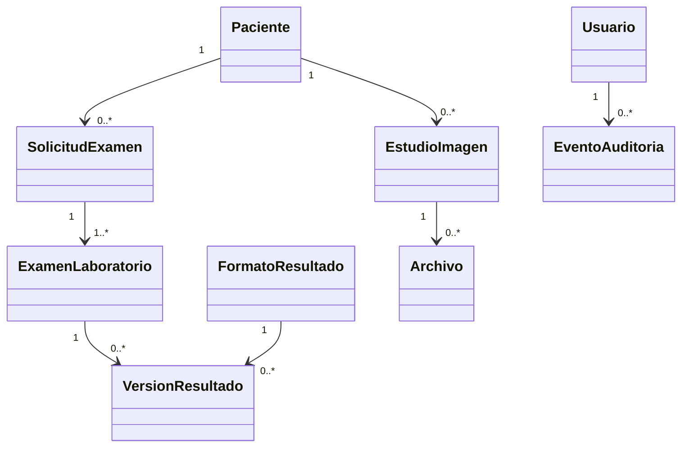
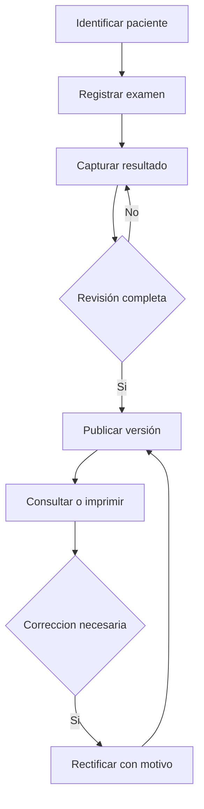
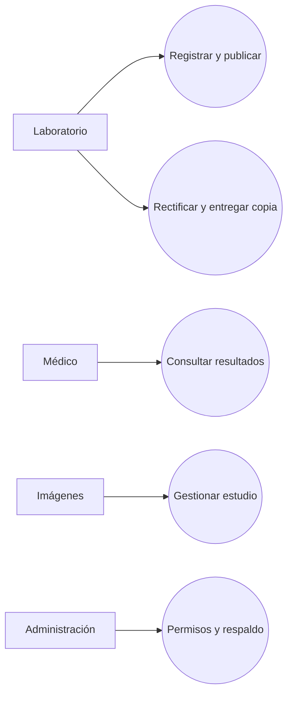

# SarcoSistema: especificación general y contexto para agentes

**Estado:** documento de trabajo, 6 de octubre de 2026. **Proyecto:** Taller de Sistemas de Información, Hospital Sarcobamba (referencia del prototipo). **Regla de lectura:** los requisitos, historias y decisiones técnicas aquí descritos son una propuesta para validar con el hospital, salvo cuando se indique expresamente que una necesidad fue expresada durante la visita. El prototipo contiene datos ficticios y no representa una implementación operativa.

## Contexto operativo para agentes

- Problema central observado: los resultados de laboratorio elaborados manualmente deben registrarse de forma legible y consultarse desde consultorios; en imágenes se necesita conservar estudios e informes recuperables.
- Producto propuesto: piloto incremental de exámenes complementarios; no reemplaza toda la historia clínica ni presupone integración con SOAPS/SNIS.
- Fuente de verdad del backlog: `Historias_Usuario_Hospital_Postentrevista.docx`, identificadores `HU-N01` a `HU-N49`. No mezclar con historias preliminares `HU-01` a `HU-33` ni con los `RF-01` antiguos de `Requerimientos TALLER SIS INFO.pdf`.
- Estado: 49 historias (26 alta, 15 media, 8 baja). El contexto maestro menciona 244 criterios; revisar el conteo en la versión de trabajo antes de usar esa cifra como métrica definitiva.
- Primer piloto recomendado: identidad, acceso y permisos, paciente, examen de laboratorio, formato de resultados, revisión/publicación, consulta/copia, rectificación y recuperación. Imágenes es siguiente fase de alto valor; Farmacia es ampliación posible. Estadística y RRHH quedaron fuera del alcance actual (sin tablas en la BD). El alcance vigente se mantiene en AGENTS.md.
- La IA de voz/RAG es experimental. No diagnóstica, no decide, no publica sin revisión humana. La propuesta visual reciente usa IA local; un texto anterior proponía API externa. No cerrar esa decisión sin validación.
- Antes de implementar: confirmar padrón/identificador de paciente, formatos reales de laboratorio, matriz de permisos, política de conservación, infraestructura, respaldo/restauración, y alcance de solicitudes urgentes/publicación parcial.
- Mantener trazabilidad `EV -> HU/CA -> RF/RNF -> CU -> prueba`. Las reglas propuestas en este documento no equivalen a aprobación institucional.

# 1. Introducción

SarcoSistema es una propuesta de sistema de información hospitalario para registrar, revisar, conservar y consultar exámenes complementarios asociados correctamente al paciente. La visita al hospital reorientó una idea inicial centrada en historia clínica/IA hacia un problema más concreto: resultados legibles de laboratorio disponibles desde los consultorios y preservacion de imágenes e informes de rayos X y ecografía. La primera entrega debe probar un flujo pequeño con personal real y datos de prueba antes de ampliar módulos. 

## 1.1. Contexto y problema

Fotografiar formularios no sustituye la captura estructurada de valores, unidades y referencias. Los resultados deben distinguir borrador, publicado, rectificado e invalidado; la consulta debe presentar la versión vigente. Tambien se identificaron necesidades en farmacia, estadística y RRHH, pero no son el núcleo del piloto.

## 1.2. Objetivo general

Disponer de un sistema web que permita al personal autorizado registrar, revisar, publicar, conservar y consultar exámenes complementarios del paciente, con resultados legibles y antecedentes de sus correcciones.

## 1.3. Objetivos específicos

1. Identificar al paciente antes de asociar solicitudes, exámenes y estudios.
2. Digitalizar formatos de laboratorio con valores, unidades, referencias y estados.
3. Habilitar revisión/publicación y consulta desde consultorio según permisos.
4. Conservar versiones anteriores y registrar responsables, motivos y fechas de rectificación.
5. Entregar copias legibles y establecer respaldos/restauración verificados.
6. Evaluar la incorporacion posterior de imágenes, farmacia, estadística y RRHH.

# 2. Estado del proyecto

Existe un informe de elicitación, backlog postentrevista, documentos tecnológicos, diagramas y un prototipo HTML navegable con 111 pantallas/estados. El HTML no tiene persistencia, backend, integración hospitalaria ni IA real. En consecuencia, las pantallas sirven para discutir flujos y no prueban que las reglas estén validadas o implementadas.

# 3. Planteamiento del nuevo sistema

## 3.1. Alcance del sistema

**Piloto propuesto:** usuarios personales, roles, identificación mínima de paciente, solicitud/examen de laboratorio, captura estructurada, revisión, publicación, consulta, impresión, rectificación, auditoría y respaldo. **Fase siguiente:** estudios e informes de imágenes y archivos asociados. **Ampliaciones:** recetas/dispensación. Reportes estadísticos y RRHH: fuera del alcance actual. Voz y RAG quedan fuera del compromiso inicial. No se asume intercambio automático con sistemas nacionales, equipos de laboratorio ni DICOM. 

### 3.1.1. Identificación de funcionalidades

| Area | Funcionalidad | Estado y referencia |
| --- | --- | --- |
| Identidad | Buscar, registrar mínimo y corregir asociación | Propuesta; HU-N01 a HU-N03 |
| Laboratorio | Solicitar/identificar, capturar, revisar y publicar | Nucleo propuesto; HU-N05 a HU-N09, HU-N43 a HU-N48 |
| Consulta | Historial, resultado vigente y copia | Nucleo propuesto; HU-N04, HU-N10, HU-N12 |
| Correccion | Rectificación versionada e invalidacion | Reglas por validar; HU-N11, HU-N13 |
| Imágenes | Estudio, adjuntos, informe, publicación y consulta | Segunda fase propuesta; HU-N14 a HU-N21 |
| Seguridad | Cuentas, autorización, auditoría, conservación | Transversal; HU-N22 a HU-N26 |
| Extensiones | Farmacia (ampliación). Estadística y RRHH: fuera de alcance actual | HU-N27 a N31, N49; N32 a N42 diferidas |

## 3.2. Metodología de desarrollo

Se propone desarrollo iterativo: discovery con usuarios, refinamiento de historias y criterios, prototipo, implementación vertical, pruebas y demostracion, retroalimentacion y ajuste. Cada incremento debe cerrar un recorrido util (por ejemplo, examen registrado -> resultado publicado -> consulta), no solo pantallas aisladas. El hospital valida flujos y formatos; el equipo registra cambios y conserva la evidencia. No se afirma que exista una metodología formal ya adoptada por la institucion.

# 4. Dominio del sistema de información

## 4.1. Entidades del dominio

| Entidad conceptual | Responsabilidad | Estado |
| --- | --- | --- |
| Paciente | Identidad interna y datos mínimos autorizados | Campos por confirmar |
| Usuario, Rol, Permiso | Cuenta personal y autorizaciones | Matriz por confirmar |
| SolicitudExamen | Agrupa uno o varios estudios solicitados | Flujo por confirmar |
| ExamenLaboratorio | Tipo, paciente, referencia, fechas y estado | Nucleo |
| FormatoResultado, CampoFormato | Define captura y versión de plantilla | Catalogo real pendiente |
| Resultado, VersionResultado | Valores, unidades, referencias y vigencia | Nucleo |
| EstudioImagen, Archivo, Informe | Estudio, imágenes y texto versionado | Segunda fase |
| EventoAuditoria | Autor, accion, fecha, recurso y motivo | Transversal |
| Respaldo | Evidencia de ejecucion y restauración | Política pendiente |
| Receta, Entrega | Prescripcion y dispensación distinguibles | Ampliacion |
Nota: los nombres anteriores son conceptuales. Los nombres físicos están en database/schema.sql (por ejemplo solicitud, estudio_solicitado, resultado_laboratorio, version_resultado). Ante cualquier diferencia, manda el esquema.

## 4.2. Relaciones entre entidades

Un paciente puede tener muchas solicitudes y exámenes. Una solicitud puede contener varios exámenes; cada examen de laboratorio usa una versión de formato y puede tener varias versiones de resultado, pero solo una vigente. Un estudio de imágenes puede tener varios archivos y versiones del informe. Un usuario realiza acciones autorizadas; la auditoría registra cada cambio relevante y su referencia al recurso. No borrar versiones publicadas por una rectificación.

## 4.3. Diagrama de clases

Modelo conceptual, no esquema físico cerrado; las cardinalidades de solicitud y estudio requieren validación del flujo real.

## 4.4. Actividades clave del sistema

Identificar paciente; registrar solicitud/examen; capturar y conservar borrador; revisar campos; publicar; consultar o imprimir; rectificar con motivo; respaldar y restaurar. Para imágenes: registrar estudio, cargar archivos, redactar/revisar informe, publicar y consultar. Ninguna actividad sustituye el criterio clínico del profesional.

## 4.5. Reglas y condiciones del sistema

Una publicación requiere permiso y datos obligatorios completos. Borradores no son visibles al médico. Una rectificación crea nueva versión y conserva la anterior para usuarios autorizados; la consulta ordinaria muestra la vigente. Los valores fuera de referencia pueden ser clínicamente reales: no deben rechazarse solo por ese motivo. Un campo vacio no significa cero, negativo o normal. Las unidades y referencias de una versión publicada permanecen históricas.

### 4.5.1. Restricciones del sistema

No hay autorización confirmada para integraciones con SOAPS/SNIS, DICOM o equipos. Tampoco están definidos disponibilidad de servidor/red, formatos de archivo, plazos legales de conservación, firma electrónica ni tiempos de respuesta. Los datos de salud exigen acceso limitado y pruebas con datos ficticios o autorizados. 

### 4.5.2. Dependencias del sistema

El piloto depende de padrón o mecanismo de alta mínimo aprobado, formatos autenticos de laboratorio, responsables de revisión, terminales/red en consultorios y laboratorio, políticas de respaldo y personal que valide el flujo. Imágenes depende ademas de tipos/tamanos de archivo y capacidad de almacenamiento.

### 4.5.3. Supuestos

Se supone, solo para planificar, acceso web interno mediante cuentas individuales y un servidor local según la arquitectura visual del equipo. Estos supuestos deben verificarse con infraestructura y responsables del hospital antes de despliegue. El plazo de 10 años mencionado durante la entrevista no se adopta como obligacion legal. ,

# 5. Proceso de ingeniería de requerimientos

## 5.1. Elicitación de requerimientos

Se partio de información preliminar y 25 candidatos `RC-01..RC-25`, luego 33 historias preliminares. La entrevista, observacion y formularios llevaron al backlog posterior de `HU-N01..HU-N49`. Las transcripciones no permiten atribuir cada afirmacion a una persona concreta. El LLM ayudo a organizar y redactar candidatos; el equipo los contrasto con evidencia humana.

## 5.2. Análisis

Se separaron necesidades expresadas (origen D) de inferencias del equipo (origen I), se detectaron dependencias, duplicados y excepciones, y se reordeno el foco hacia laboratorio e imágenes. Se revisan conflictos como paciente inexistente, doble envio, fallo de guardado, valores no convencionales, publicación incompleta y consulta sin permiso. 

## 5.3. Especificación

La unidad de trabajo es `HU-Nxx` con rol, necesidad, propósito, prioridad, origen, evidencia `EV`, criterios `CA-xx`, dependencias y campo `Por confirmar`. Los `RF-S` y `RNF-S` de este documento son una linea base nueva propuesta para trazabilidad; no reutilizan los `RF-01..` preliminares del documento anterior. 

## 5.4. Validación

Revisar con laboratorio, médicos, imágenes, direccion e infraestructura los recorridos y formularios reales. Ejecutar criterios de aceptacion con datos ficticios, incluyendo errores, permisos y rectificaciones. Registrar aprobación, cambios o rechazo por historia. Ninguna historia debe marcarse validada solo porque aparece en el prototipo.

## 5.5. Gestión

Versionar historias y decisiones; mantener estado (propuesta, validada, en desarrollo, probada, desplegada); exigir análisis de impacto en formatos, seguridad, migracion y pruebas para cada cambio. Mantener los enlaces `EV/HU/CA/RF/CU/prueba` y un registro de cuestiones abiertas.

# 6. Historias de usuario

## 6.1. Criterios de calidad INVEST

Las historias deben ser independientes cuando sea posible, negociables, valiosas, estimables, pequeñas y verificables. En este backlog hay dependencias legitimas: publicar requiere capturar/revisar, consultar requiere publicar y rectificar requiere una versión publicada. Partir historias excesivamente amplias sin perder el recorrido completo; usar criterios observables, no solo descripciones de interfaz.

## 6.2. Historias de usuario funcionales

El backlog oficial postentrevista contiene 49 historias. Las siguientes agrupaciones conservan sus identificadores, pero resumen los titulos; para criterios completos prevalece la ficha original.

| Grupo | Historias y propósito |
| --- | --- |
| Paciente | HU-N01 buscar; N02 alta mínima; N03 corregir asociación; N04 consultar exámenes anteriores |
| Laboratorio | HU-N05 identificar examen; N06 capturar resultado; N07 unidades/referencias; N08 borrador; N09 publicar; N10 consultar; N11 rectificar; N12 copia; N13 invalidar duplicado |
| Imágenes | HU-N14 registrar estudio; N15 guardar archivos; N16 informe; N17 publicar; N18 visualizar; N19 leer informe; N20 rectificar informe; N21 rectificar archivo |
| Control | HU-N22 cuenta personal; N23 permisos; N24 auditoría; N25 conservar; N26 recuperar |
| Farmacia | HU-N27 receta; N28 recibirla; N29 rectificar/anular; N30 copia; N31 registrar entrega; N49 receptor |
| Estadística | HU-N32 reutilizar reporte; N33 correspondencia de indicadores; N34 consolidar; N35 guardar versión presentada | (fuera de alcance actual).
| RRHH | HU-N36 importar asistencia; N37 fines de semana; N38 ausencia; N39 feriados; N40 horario; N41 planilla; N42 personal activo | (fuera de alcance actual).
| Flujo de solicitudes | HU-N43 varios estudios; N44 pendientes; N45 urgentes; N46 muestra; N47 publicar por partes; N48 administrar formatos |

Ejemplo de historia: `HU-N10`: como médico autorizado, quiero abrir resultados de laboratorio publicados desde el consultorio, para revisarlos sin depender de un informe manuscrito. Un criterio exige ver la versión vigente y no mostrar borradores ni resultados sin permiso.

## 6.3. Historias de usuario no funcionales técnicas

Se proponen para refinamiento, sin atribuirlas a la entrevista como historias aprobadas:

| ID nuevo | Historia técnica propuesta | Evidencia de aceptacion |
| --- | --- | --- |
| HU-T01 | Como administrador, quiero gestionar roles granulares para limitar datos clínicos | Prueba de acceso permitido y denegado por endpoint |
| HU-T02 | Como responsable, quiero recuperar datos tras un fallo | Restauracion probada con datos y adjuntos coherentes |
| HU-T03 | Como auditor, quiero rastrear publicaciones y cambios | Evento con actor, fecha, recurso, accion y motivo |
| HU-T04 | Como operador, quiero detectar fallos de servicio | Alertas/logs sin exponer datos clínicos sensibles |
| HU-T05 | Como equipo, quiero desplegar y migrar versiones controladas | Instalacion reproducible y rollback ensayado |

## 6.4. Priorización MoSCoW

La fuente original usa **alta/media/baja**, no MoSCoW. La conversion siguiente es **propuesta de planificacion**, no un cambio retroactivo del backlog: `Must` abarca el piloto mínimo y seguridad/recuperación; `Should` imágenes y mejoras del flujo, aunque varias historias de imágenes tienen prioridad alta; `Could` farmacia/estadística/RRHH según capacidad; `Won't por ahora` voz/RAG y conexiones no autorizadas. Prioridad alta no garantiza entrada al primer despliegue. 

## 6.5. Diagrama de actividades

# 7. Requisitos del sistema

Los siguientes identificadores `RF-S`/`RNF-S` pertenecen solo a esta síntesis y deben aprobarse antes de convertirlos en especificación contractual.

## 7.1. Requisitos funcionales RF

| ID | Requisito propuesto | HU fuente |
| --- | --- | --- |
| RF-S01 | Buscar/identificar paciente sin seleccionar automaticamente homonimos | N01-N03 |
| RF-S02 | Registrar examen y relacionarlo con paciente/solicitud | N05, N43-N46 |
| RF-S03 | Capturar valores con formato versionado, unidades y referencias | N06-N08, N48 |
| RF-S04 | Revisar y publicar solo datos completos y autorizados | N09, N47 |
| RF-S05 | Consultar historial y resultado vigente desde consultorio | N04, N10 |
| RF-S06 | Generar copia legible de la versión publicada | N12 |
| RF-S07 | Rectificar/invalidar preservando antecedentes y motivo | N03, N11, N13 |
| RF-S08 | Registrar, publicar y consultar estudio e informe de imágenes | N14-N21 |
| RF-S09 | Gestionar cuentas, roles y eventos de auditoría | N22-N24 |
| RF-S10 | Respaldar y recuperar datos y archivos | N25-N26 |
| RF-S11 | Gestionar recetas y entregas, con receptor | N27-N31, N49 |
| RF-S12 | (Fuera de alcance actual) Consolidar reportes y procesar asistencia | N32-N42 |

## 7.2. Requisitos no funcionales RNF

| ID | Condicion medible pendiente de acuerdo | Verificacion prevista |
| --- | --- | --- |
| RNF-S01 | Confidencialidad: TLS/HTTPS y RBAC en servidor, denegacion por defecto | Pruebas de permisos y configuración |
| RNF-S02 | Integridad: transacción al publicar/rectificar, una sola versión vigente | Pruebas de concurrencia y fallo |
| RNF-S03 | Auditabilidad: cambios clínicos con actor, recurso y marca temporal | Revisión de eventos y accesos |
| RNF-S04 | Recuperabilidad: backups de BD y archivos, restauración ensayada | Simulacro; definir RPO/RTO con hospital |
| RNF-S05 | Usabilidad: lectura clara, errores explicitos, impresión sin recortes | Prueba con usuarios y formatos reales |
| RNF-S06 | Rendimiento: definir tiempos de consulta/carga según red y equipos reales | Medicion piloto, umbral por acordar |
| RNF-S07 | Mantenibilidad: migraciones, versiones, CI y pruebas reproducibles | Revisión de pipeline y despliegue |
| RNF-S08 | Privacidad: datos de prueba ficticios; controles de retencion por definir | Inspeccion de datos y política aprobada |

# 8. Casos de uso

## 8.1. Derivación de casos de uso CU a partir de HU

| CU | Actor principal | Resultado | HU relacionadas |
| --- | --- | --- | --- |
| CU-01 Identificar paciente | Laboratorio | Paciente confirmado o error visible | N01-N03 |
| CU-02 Registrar examen | Laboratorio | Examen único asociado | N05, N43-N46 |
| CU-03 Capturar resultado | Laboratorio | Borrador legible recuperable | N06-N08, N48 |
| CU-04 Publicar resultado | Revisor autorizado | Version vigente publicada | N09, N47 |
| CU-05 Consultar resultado | Médico | Solo versión autorizada vigente | N04, N10 |
| CU-06 Rectificar resultado | Responsable autorizado | Nueva versión con motivo | N11, N13 |
| CU-07 Entregar copia | Laboratorio | Impresion de versión publicada | N12 |
| CU-08 Gestionar imágenes | Imágenes | Estudio/informe publicado consultable | N14-N21 |
| CU-09 Administrar acceso | Administración | Permisos efectivos y auditados | N22-N24 |
| CU-10 Recuperar información | Administración | Datos y archivos restaurados | N25-N26 |

## 8.2. Descripción breve de casos críticos

**CU-04:** precondición: examen con paciente, formato y datos requeridos; actor autenticado con permiso. Flujo: revisar paciente/valores -> validar -> publicar atómica y versionadamente -> registrar auditoría. Alternos: dato faltante o fallo de transacción impide la publicación. **CU-05:** médico autorizado abre paciente, filtra exámenes, ve versión vigente; acceso sin permiso o carga fallida muestra un error apropiado. **CU-06:** responsable aporta motivo, crea nueva versión y conserva la anterior restringida; cancelar o fallar mantiene vigente la anterior.

## 8.3. Diagrama de casos de uso

# 9. Stack tecnológico

## 9.1. Criterios de selección tecnológica

Se priorizan simplicidad de despliegue local, mantenibilidad por un equipo pequeno, integridad transaccional, control de acceso, bajo acoplamiento, facilidad de prueba y posibilidad de crecer por módulos sin fragmentar prematuramente servicios. IA no debe condicionar el primer piloto. []

## 9.2. Arquitectura tecnológica

Monolito modular web: navegador interno con React -> HTTPS -> API FastAPI -> PostgreSQL y almacenamiento de archivos separado. Autorización y auditoría pasan por el backend; nunca por el navegador directamente. Los módulos de dominio se separan internamente (identidad, pacientes, laboratorio, imágenes, seguridad, archivos, auditoría). MVC describe la separacion interfaz/control/datos; los principios de Clean Architecture pueden usarse dentro de módulos sin duplicar capas innecesarias. []

## 9.3. Stack tecnológico seleccionado

### 9.3.1. Lenguajes de programación

Python para API y JavaScript/TypeScript para frontend (TypeScript es recomendacion de implementación, no decisión histórica confirmada); SQL para consultas/migraciones. []

### 9.3.2. Tecnologías de frontend

React, navegador web interno y componentes de formularios/tablas. La selección de empaquetador y biblioteca visual concreta queda pendiente de repositorio y pruebas de accesibilidad. []

### 9.3.3. Tecnologías de backend

Python con FastAPI; API REST y lógica de negocio en módulos. ORM confirmado: SQLAlchemy 2 (async) con asyncpg y Alembic. Cola de trabajos y otras bibliotecas se definen cuando haya un caso concreto.

### 9.3.4. Sistema gestor de base de datos

PostgreSQL para datos relacionales; pgvector solo si se aprueba una funcionalidad RAG posterior. Archivos clínicos fuera de las tablas, con metadatos y referencias seguras en BD. []

### 9.3.5. Tecnologías de comunicación e integración

HTTPS, JSON y endpoints REST. No incluir integraciones con sistemas externos sin convenio/autorización y contrato de datos. []

### 9.3.6. Tecnologías de seguridad

JWT en flujo OAuth2 propuesto, Argon2id para contraseñas, RBAC del lado servidor, TLS, auditoría y respaldos. Cifrado en reposo es objetivo de diseño por definir según infraestructura. []

## 9.4. Frontend

### 9.4.1. Framework

React organiza vistas por rol y flujo. Evitar duplicar pantallas del prototipo como lógica de negocio: el HTML es referencia visual. []

### 9.4.2. Lenguaje

El frontend arrancó en JavaScript (.jsx). TypeScript sigue recomendado para contratos de API y formularios; migrar de forma incremental si el tiempo lo permite.

### 9.4.3. Librerías

Axios y React Query ya figuran en la propuesta del equipo. Otras librerias se seleccionan solo cuando haya casos concretos. []

### 9.4.4. Gestión de estado

React Query para estado remoto (cache, carga, error e invalidacion); estado local para formularios y UI. Evitar que la cache muestre una versión antigua tras publicar/rectificar; invalidar consultas relacionadas. []

### 9.4.5. Comunicación con backend

Cliente Axios centralizado, autenticación controlada, manejo uniforme de errores y reintentos seguros solo en operaciones idempotentes. La autorización real siempre ocurre en API. []

## 9.5. Backend

### 9.5.1. Framework

FastAPI expone contratos OpenAPI y validación de solicitudes. []

### 9.5.2. Lenguaje

Python, con tipado y validación de esquemas en límites de entrada/salida. []

### 9.5.3. Arquitectura interna

Modulos por dominio con rutas/controladores, servicios/casos de uso, modelos y repositorios. Publicación, rectificación y asociación del paciente deben ejecutarse en transacciones coherentes. []

### 9.5.4. ORM y acceso a datos

SQLAlchemy 2 (async) y Alembic, confirmados al crear el repositorio. Migraciones versionadas y consultas parametrizadas.

### 9.5.5. Gestión de servicios

FastAPI es el punto de entrada para BD, archivos y, solo en etapa futura, IA. Trabajos de respaldo y procesamiento pesado deben ser observables, repetibles y no bloquear la consulta. []

## 9.6. Base de datos

### 9.6.1. Sistema gestor

PostgreSQL. Definir versión compatible con infraestructura y ciclo de mantenimiento. []

### 9.6.2. Modelo de datos

Tablas normalizadas para paciente, usuario/rol/permiso, solicitud, examen, formato, campo, resultado/versión, estudio/archivo/informe y evento. Usar claves internas estables y restricciones de unicidad donde el hospital confirme reglas de identificación. []

### 9.6.3. Estructura y relaciones

Claves foraneas protegen asociaciones; versiones publicadas son históricas; un indicador de vigencia se cambia de forma atómica. Los binarios no se guardan en columnas como mecanismo principal; metadatos y hashes pueden facilitar integridad. []

### 9.6.4. Estrategia de acceso a datos

Repositorios por módulo, transacciones explicitas y consultas paginadas. Filtrar por autorización en servidor, incluidos accesos directos por identificador. Nunca exponer toda la base para resolver una pantalla. []

## 9.7. API y comunicación entre componentes

### 9.7.1. Arquitectura de la API

REST versionada (sin prefijo por ahora) con esquemas de entrada/salida y operaciones auditables. []

### 9.7.2. Endpoints

Convención: nombres en español, plural, sin prefijo de versión por ahora (el prefijo /api/v1 queda para cuando haya consumidores externos). Rutas orientativas, sujetas a validación: POST /accesos/login, GET /pacientes, POST /pacientes, POST /examenes, PUT /examenes/{id}/borrador, POST /examenes/{id}/publicar, POST /examenes/{id}/rectificaciones, GET /pacientes/{id}/resultados, GET /examenes/{id}/copia, POST /estudios-imagen, GET /auditoria. No son endpoints existentes.

### 9.7.3. Métodos HTTP

`GET` lee, `POST` crea o activa transiciones (publicar/rectificar), `PUT/PATCH` actualiza borradores, sin permitir sobrescritura de versiones publicadas. Proteger reintentos para evitar duplicados. []

### 9.7.4. Formato de intercambio de datos

JSON para datos; carga de archivos mediante multipart o flujo controlado, con metadatos y límites a definir. Fechas con zona horaria explicita; decimales sin pérdida de precision clínica. []

### 9.7.5. Manejo de errores

Respuesta consistente con código, mensaje seguro, detalles de validación y correlacion. Diferenciar no encontrado, sin permiso, conflicto de versión, validación fallida y fallo del servidor; no filtrar datos de otro paciente. []

## 9.8. Seguridad

### 9.8.1. Autenticación

Cuenta individual; flujo de inicio de sesion propuesto OAuth2/JWT. Definir política de bloqueo/recuperación y expiracion con la institucion. []

### 9.8.2. Autorización

RBAC por accion/recurso: capturar, revisar/publicar, consultar, imprimir, rectificar, auditar y administrar. Los roles demo no son una matriz de permisos aprobada. []

### 9.8.3. Gestión de tokens

JWT de vida limitada, validación de firma/expiracion y estrategia de renovacion/revocacion por decidir; no incluir datos clínicos sensibles en el token. []

### 9.8.4. Protección de contraseñas

Hash Argon2id y secretos fuera del repositorio; no registrar contraseñas ni tokens completos en logs. []

### 9.8.5. Protección de datos

HTTPS, acceso mínimo, auditoría, copias protegidas y políticas de retencion/restauración por acordar. Evaluar cifrado en reposo y manejo de claves según infraestructura real. []

## 9.9. Control de versiones y gestión del código y dependencias

Git con ramas y revisiones; cambios de BD mediante migraciones; dependencias declaradas y fijadas mediante archivos de lock o equivalentes. Versionar contratos API y decisiones de arquitectura. No incluir credenciales, claves ni datos reales en repositorio.

## 9.10. Entorno y herramientas de desarrollo

Ambiente local reproducible, base de datos de prueba y datos ficticios; Docker Compose es la propuesta de despliegue del equipo. Registrar procedimientos de instalacion, migracion y restauración. CI con GitHub Actions (workflows backend-ci.yml y frontend-ci.yml). La gestión de incidencias se define según el equipo.

## 9.11. Estrategia de pruebas

### 9.11.1. Pruebas unitarias

Validar reglas de estados, campos obligatorios, precision, referencias, permisos y versiones sin servicios externos.

### 9.11.2. Pruebas de integración

Comprobar transacciones BD/archivos, unicidad, auditoría, concurrencia y restauración coherente de adjuntos.

### 9.11.3. Pruebas de API

Verificar contratos, codigos HTTP, acceso sin permiso, enlace directo, doble envio, conflictos de versión y fallos de publicación.

### 9.11.4. Pruebas de frontend

Flujos completos para laboratorio y médico: paciente correcto, captura, borrador, publicación, consulta, rectificación, impresión y estados de error.

### 9.11.5. Criterios de aceptación

Ejecutar cada `HU-Nxx/CA-yy` relevante con datos ficticios y evidencia de resultado. Un criterio aprobado debe señalar versión de historia, responsable de validación y fecha; falta acordar esos responsables.

## 9.12. Despliegue e infraestructura

### 9.12.1. Despliegue del frontend

Compilacion estatica servida internamente bajo HTTPS; verificar equipos y navegadores del hospital. []

### 9.12.2. Despliegue del backend

Servicio FastAPI en servidor local Ubuntu Server, contenedores Docker Compose según la arquitectura visual, sujeto a capacidad y aprobación de TI. []

### 9.12.3. Despliegue de la base de datos

PostgreSQL con volumen persistente, acceso restringido, respaldo de datos y verificacion de restauración; almacenamiento de adjuntos respaldado en conjunto. []

### 9.12.4. Gestión de variables de entorno

Credenciales y claves fuera del código; separar desarrollo/pruebas/produccion, restringir permisos, rotar secretos y documentar configuración sin publicarlos. []

## 9.13. Integración del stack tecnológico

El navegador solicita recursos a FastAPI con credenciales; FastAPI valida identidad/permisos, realiza transacciones en PostgreSQL, controla archivos y registra auditoría. React Query actualiza o invalida vistas al publicar/rectificar. Los servicios de IA, si se aprueban, se integran tras el backend y con revisión humana. []

## 9.14. Matriz de trazabilidad requerimiento tecnología

| Necesidad | HU | RF/RNF | CU | Tecnología y prueba |
| --- | --- | --- | --- | --- |
| Paciente correcto | N01-N03 | RF-S01 | CU-01 | PostgreSQL; homonimos/duplicados |
| Resultado legible | N05-N09 | RF-S02-04 | CU-02-04 | React/FastAPI/PostgreSQL; captura/publicación |
| Consulta segura | N04, N10, N22-N23 | RF-S05, RNF-S01 | CU-05, CU-09 | JWT/RBAC; acceso directo denegado |
| Rectificación | N11 | RF-S07, RNF-S02-03 | CU-06 | Transaccion/versiones/auditoría |
| Imágenes | N14-N21 | RF-S08 | CU-08 | Archivos + metadatos; consulta autorizada |
| Recuperación | N25-N26 | RF-S10, RNF-S04 | CU-10 | Backup BD/archivos; simulacro |

## 9.15. Análisis comparativo de alternativas tecnológicas

| Decisión | Alternativa elegida/propuesta | Alternativa | Motivo y condicion |
| --- | --- | --- | --- |
| Arquitectura | Monolito modular | Microservicios | Menos operación para piloto; reevaluar si escala/equipos lo exigen |
| Datos | PostgreSQL | BD documental | Relaciones y transacciones del dominio |
| Archivos | Repositorio separado | Binarios en BD | Gestión de tamanos/respaldos; validar soporte y seguridad |
| IA futura | Local según visual reciente | API externa según texto anterior | Decidir costo, privacidad, capacidad y autorización antes de adoptar |

## 9.16. Ventajas y desventajas del stack seleccionado

Ventajas: tecnologías ampliamente conocidas por el equipo, API documentable, transacciones relacionales, módulos evolutivos y despliegue local propuesto. Costos/riesgos: administración de servidor, seguridad, respaldo conjunto de BD/archivos, monitoreo, recursos para IA local y disciplina de versionado. La viabilidad requiere prueba en la infraestructura real. []

## 9.17. Decisiones arquitectónicas

**Propuestas vigentes:** monolito modular, React/FastAPI/PostgreSQL, archivos separados, HTTPS/JWT/Argon2id/RBAC/auditoría y servidor local. **Pendientes:** esquema de identidad, formato de archivos, red/servidor disponibles, RPO/RTO, retencion, mecanismo de integración y modalidad de IA. Registrar cada resolución en un ADR con alternativas, razon y fecha. []

## 9.18. Roadmap tecnológico

1. **Descubrimiento:** validar formatos, permisos, identidad, red y alcance del piloto.
2. **Base:** repositorio, ambiente, modelos, autenticación, auditoría y pruebas.
3. **Piloto laboratorio:** registro -> captura -> revisión -> consulta/copia -> rectificación -> restauración.
4. **Imágenes:** adjuntos, informe, publicación y consulta.
5. **Ampliaciones:** farmacia según acuerdos. Estadística y RRHH diferidas.
6. **Exploracion:** voz/RAG solo con controles clínicos, privacidad, fuentes y evaluacion.

# 10. Gestión de riesgos

| Riesgo | Impacto | Mitigacion/decisión pendiente |
| --- | --- | --- |
| Asociar examen a paciente equivocado | Alto | Identificación visible, confirmacion y rectificación auditada |
| Publicar dato incompleto o versión antigua | Alto | Validación, transacción, estado vigente y pruebas de concurrencia |
| Acceso no autorizado a datos clínicos | Alto | RBAC en API, HTTPS, auditoría y pruebas negativas |
| Perdida de BD o archivos | Alto | Respaldo conjunto, restauración probada, RPO/RTO acordados |
| Formatos de laboratorio mal modelados | Alto | Formularios reales y validación del servicio antes de captura |
| Infraestructura insuficiente | Alto | Levantamiento de red/equipos/almacenamiento y piloto medido |
| Expansion prematura de alcance | Medio | MoSCoW propuesto y cierre del flujo laboratorio |
| IA interpretada como diagnóstico | Alto | IA fuera del piloto, revisión humana y fuentes visibles |
| Dependencia externa no autorizada | Alto | Convenios/contratos antes de integrar SOAPS/SNIS/equipos |

# 11. Trazabilidad

La cadena mínima es **evidencia `EV` -> historia `HU-Nxx` -> criterio `CA-yy` -> requisito `RF-S/RNF-S` -> caso `CU-xx` -> prueba -> estado de validación**. Ejemplo: entrevista/formato `EV` -> `HU-N06/CA-04` (campo vacio permanece pendiente) -> `RF-S03` -> `CU-03` -> prueba de guardado/lectura del borrador. Otro: `HU-N10/CA-04` -> `RF-S05` -> `CU-05` -> prueba de versión vigente tras rectificación. Las claves `EV` y `CA` exactas deben tomarse de las fichas fuente; no inferir aprobación a partir de esta matriz. 

**Preguntas de cierre antes de construir:** identificador y padrón, formatos/valores de referencia, matriz de permisos, responsables de publicación/rectificación, urgencias y publicación parcial, retencion, RPO/RTO, impresiones/firmas, archivos de imagen, hardware/red y modalidad de IA. Registrar respuesta, responsable, evidencia y versión afectada.

## Fuentes del proyecto

- **[[]]** `Informe_Hospital_Elicitacion_y_Historias.docx` y `SARCOSISTEMA_CONTEXT_MASTER.txt`: visita, alcance, metodología y advertencias.
- **[[]]** `Historias_Usuario_Hospital_Postentrevista.docx`: fichas HU-N01..HU-N49, criterios CA, evidencia, prioridades y pendientes.
- **[[]]** `SARCOSISTEMA_CONTEXT_MASTER.txt`, `sarcosistema.pdf` y visuales finales de arquitectura/flujo: stack y evolucion de decisiones.
- **Prototipo:** `SarcoSistema_Prototipo_Navegable.html`, solo demostracion visual sin persistencia.
